<p align="center">
  
</p>

<p align="center">

</p>

<p align="center">
<a href="https://tahasohail.vercel.app/">Portfolio</a> •
<a href="https://www.linkedin.com/in/taha-sohail-7b03b8320/">LinkedIn</a> •
<a href="mailto:tahasohail85@gmail.com">Email</a>
</p>

<p align="center">


</p>

## 👨‍💻 Who I Am

```ts
const taha = {
  title: "BS Software Engineering Student @ FAST-NUCES | AI/ML Intern @ ORBIT-I",
  stack: ["React", "Next.js", "Node.js", "Express", "Python", "Django", "Flask",
          "MongoDB", "SQL Server", "PyTorch", "LangChain", "LangGraph"],
  launchedProjects: ["Studify", "Smart Disaster Response MIS",
                      "Cybercrime Digital Evidence Integrity Management System",
                      "Ocean Route Navigator"],
  certifications: ["Google Coursera - Crash Course on Python",
                    "Teaching Assistant, Discrete Structures - FAST-NUCES"],
  status: "Interning @ ORBIT-I (AI/ML) & FlyRank | Officer @ FAST Computing Society",
  openTo: ["Open Source", "Internships", "Freelance Work", "Collaboration"]
}
```

## 🚀 Featured Projects

### Studify — AI-Powered Study Companion
Full-stack MERN study platform where students chat with their own notes via a custom RAG pipeline with local embeddings and MongoDB Atlas Vector Search, plus AI summaries, quizzes, and OCR for scanned documents. Ships secure auth (JWT + email OTP), rate limiting, per-user data isolation, and multi-provider LLM failover.

<p align="left">

</p>

| Layer | Technology |
|---|---|
| Frontend | React |
| Backend | Node.js, Express |
| Database | MongoDB Atlas (Vector Search) |
| AI/ML | Local RAG, OCR, Multi-provider LLM failover |
| Auth | JWT, Email OTP |

**Live:** https://studify-six.vercel.app • **Code:** https://github.com/TahaSohail-Goat/Studify

### Smart Disaster Response MIS
Full-stack disaster management information system with role-based dashboards, real-time coordination, SQL Server triggers, and ACID transactions.

<p align="left">

</p>

| Layer | Technology |
|---|---|
| Frontend | Next.js |
| Backend | Node.js, Express.js |
| Database | SQL Server |
| Features | RBAC Dashboards, Triggers, ACID Transactions |

**Code:** https://github.com/TahaSohail-Goat/SmartDisasterResponseMIS

### Cybercrime Digital Evidence Integrity Management System
Desktop evidence management system with SHA-256 tamper detection, immutable chain-of-custody logs, a state-machine workflow, and RBAC for three investigative roles.

<p align="left">

</p>

| Layer | Technology |
|---|---|
| Application | Java, JavaFX |
| Database | SQL Server |
| Security | SHA-256 Integrity Verification, Chain-of-Custody Logs |

**Code:** https://github.com/TahaSohail-Goat/CDIEM

### Ocean Route Navigator
Maritime route planner using Dijkstra's and A* algorithms, built with custom priority queues and graph data structures.

<p align="left">

</p>

| Layer | Technology |
|---|---|
| Language | C++ |
| Library | SFML |
| Algorithms | Dijkstra's, A* Search |

**Code:** https://github.com/TahaSohail-Goat/SeaRoute-Navigator

## 🛠 Tech Stack

**Languages**
<br/>


**Frontend**
<br/>


**Backend**
<br/>


**AI / Database**
<br/>


*Also working with: SQL Server, LangChain, LangGraph, Scikit-learn, Pandas*

**Dev Tools**
<br/>


## 📈 GitHub Stats

<p align="left">


</p>

<p align="left">

</p>

<p align="left">

</p>

<p align="left">

</p>

## 📬 Connect

<p align="left">
<a href="https://tahasohail.vercel.app/"></a>
<a href="https://www.linkedin.com/in/taha-sohail-7b03b8320/"></a>
<a href="mailto:tahasohail85@gmail.com"></a>
</p>

<p align="center">

</p>
